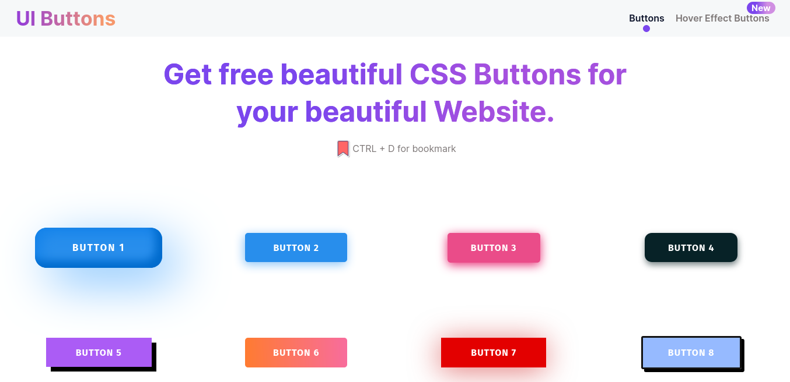

<br />
<div align="center">
  <a href="https://github.com/Ashraful-malik/uibuttons">
    
  </a>
  <p align="center">
    <br />
    <a href="https://uibuttons.netlify.app/">View Demo</a>
    ·
    <a href="https://github.com/Ashraful-malik/uibuttons/issues">Report Bug</a>
    ·
    <a href="https://github.com/Ashraful-malik/uibuttons/issues">Request Feature</a>
  </p>
</div>

  <!-- ABOUT THE PROJECT -->

## About The Project



Now we don't have to create the same Button from scratch in CSS again and again. We can use the <a href="https://uibuttons.netlify.app/">
uiButtons
</a> for the beautiful Buttons just click and copy the code and use it anywhere on your website. <a href="https://uibuttons.netlify.app/hover-buttons">
<b>We have also the Hover Effect Buttons</b>
</a>

### 💻 Built With

- [Nuxt.js](https://nextjs.org/)
- [Vue.js](https://vuejs.org/)
- [CSS](https://web.dev/learn/css/)
- [scss](https://sass-lang.com/)
- [HTML](https://html.com/)

<p align="right">(<a href="#top">back to top</a>)</p>

## Getting Started

```bash
# install dependencies
$ npm install

# serve with hot reload at localhost:3000
$ npm run dev

# build for production and launch server
$ npm run build
$ npm run start

# generate static project
$ npm run generate
```

<!-- CONTACT -->

## Contact

Ashraful - [@Ashraful\_\_malik](https://twitter.com/Ashraful__malik) - ashrafulmalik71@gmail.com.com

<p align="right">(<a href="#top">back to top</a>)</p>
